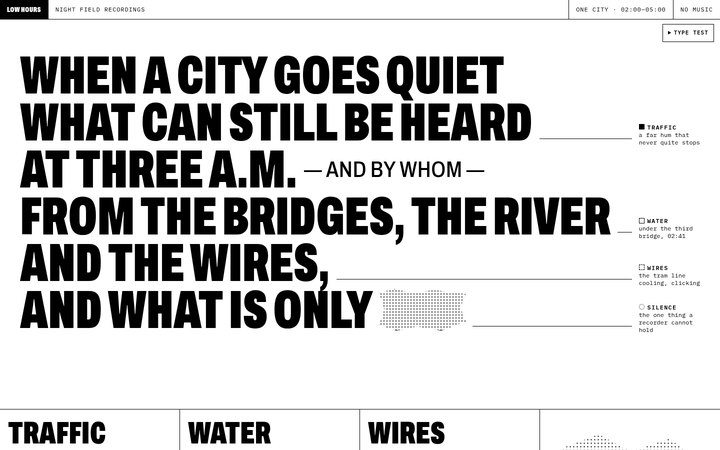
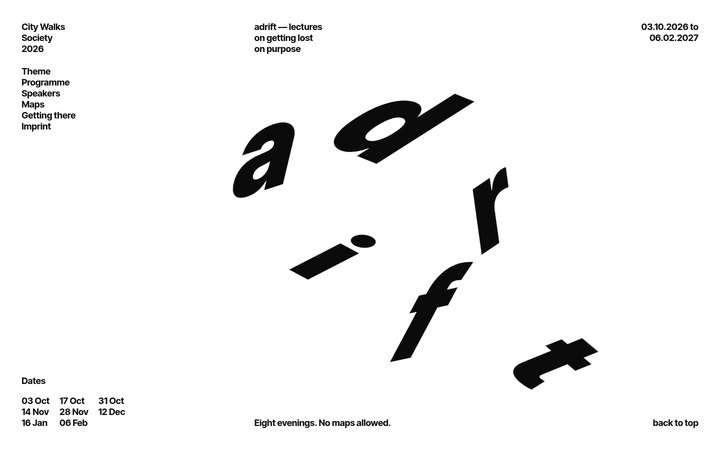
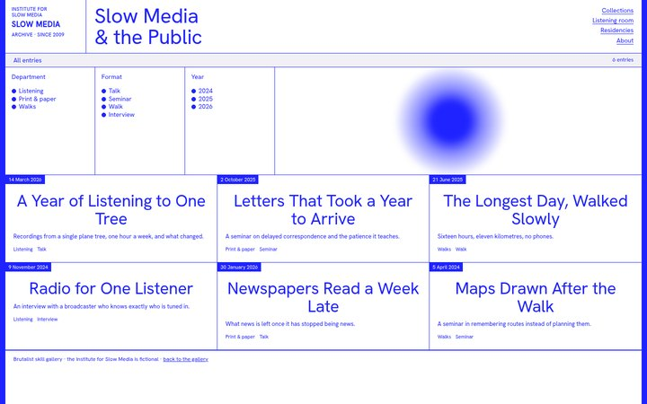
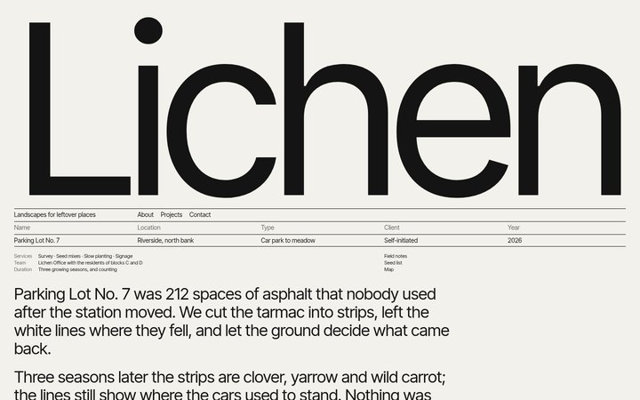
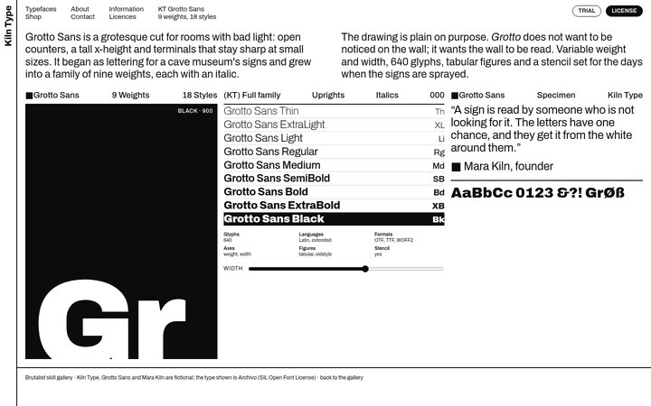
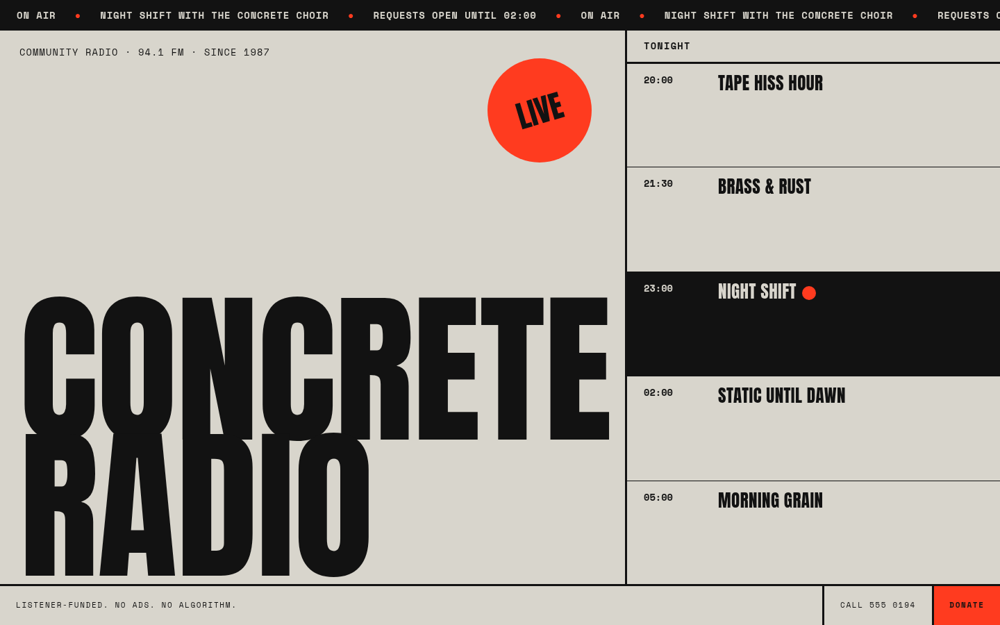
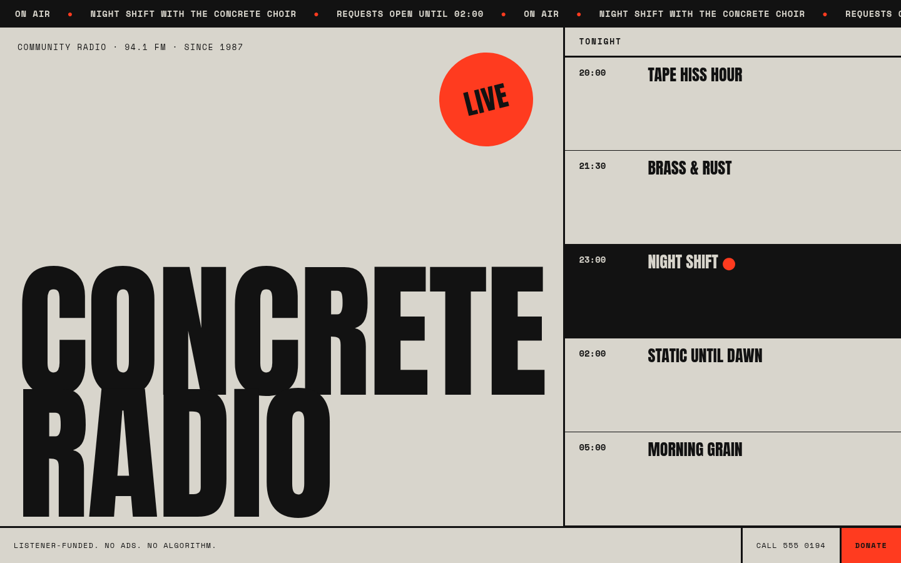
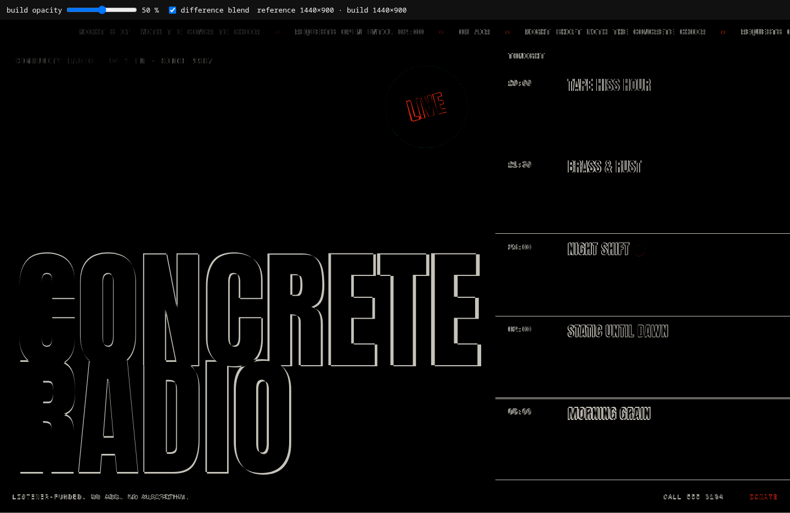

# brutalist

**An agent skill for brutalist web design.** Give your coding AI a screenshot of a raw,
experimental website and it rebuilds it as a working page — motion included — or uses it
as a springboard for something new. It measures instead of guessing, and says what it
invented.

> **Quick start:** `npx brutalist-design-skill`, restart your tool, then
> `/brutalist recreate path/to/screenshot.png`. Live gallery:
> **[135andres.github.io/brutalist-design-skill](https://135andres.github.io/brutalist-design-skill/)**

| | | |
|---|---|---|
| [](https://135andres.github.io/brutalist-design-skill/examples/gallery/low-hours/) **[Low Hours](https://135andres.github.io/brutalist-design-skill/examples/gallery/low-hours/)** — labels slide in as you scroll; a night log replays line by line | [](https://135andres.github.io/brutalist-design-skill/examples/gallery/adrift/) **[adrift](https://135andres.github.io/brutalist-design-skill/examples/gallery/adrift/)** — letters fall into place, then drift with the pointer | [](https://135andres.github.io/brutalist-design-skill/examples/gallery/slow-media/) **[Slow Media](https://135andres.github.io/brutalist-design-skill/examples/gallery/slow-media/)** — working filters; a blue blob follows you, slowly |
| [](https://135andres.github.io/brutalist-design-skill/examples/gallery/lichen-office/) **[Lichen Office](https://135andres.github.io/brutalist-design-skill/examples/gallery/lichen-office/)** — a wordmark that fits the width exactly | [](https://135andres.github.io/brutalist-design-skill/examples/gallery/kiln-type/) **[Kiln Type](https://135andres.github.io/brutalist-design-skill/examples/gallery/kiln-type/)** — hover the weight ladder, the giant letters change | [](examples/recreate-concrete-radio/README.md) **[Concrete Radio](examples/recreate-concrete-radio/README.md)** — recreated from one PNG, every step documented |

Every name and number in the gallery is invented. The pages were made with the skill's
`inspire` and `edit` commands, several from third-party references — taking principles,
never their text, marks or images ([more](examples/README.md)).

## Why

Brutalist and experimental sites are where the interesting references are — and the
hardest to rebuild from a picture. A still image does not tell you the font, the speed of
the marquee, what happens on hover, or what is below the fold. Left alone, an AI guesses
and presents the guesses as fact, or smooths the design back into a template.

This skill makes the agent **say how it knows**: every property it reads from a reference
is `observed`, `measured`, `estimated`, `ambiguous` or `unknown`; everything it infers or
chooses is marked `INFERENCE` or `DECISION`. It measures instead of eyeballing, climbs to
heavier techniques only when the design needs them, and never scores its own work — you
judge.

## Commands

```
/brutalist <command> <target>
```

| Command | What it does | Status |
|---|---|---|
| `recreate <image>` | Rebuild a reference image as a working interface: rights check, inventory, build, fixed-condition comparison, report | specified |
| `motion <page>` | Plan and build motion — from an animated source, or declared as invention for a still | under review |
| `inspire <images…>` | Turn references into divergent sketches and digestible visual questions, taking principles, not copies | experimental |
| `edit <page>` | Change an existing page: the smallest change first, escalate only if needed | experimental |
| `verify <page>` | Screenshots under fixed conditions, comparison and an accessibility pass | not specified |
| `critique <page>` | A design review without scores | not specified |

No command? Describe what you want — "rebuild this", "inspire me with these", "give this
page more flavour" — and the skill picks the command.

```
/brutalist recreate refs/poster-site.png
/brutalist motion recreations/poster-site/build/index.html
/brutalist inspire refs/*.png
/brutalist edit src/pages/home.html
```

## Install

```bash
npx brutalist-design-skill
```


No dependencies: `npx` runs [`install.mjs`](install.mjs), published on npm as
[`brutalist-design-skill`](https://www.npmjs.com/package/brutalist-design-skill). Pick **everywhere** (your home folder) or **this project**, then the tools; it
copies [`skill/brutalist/`](skill/brutalist/SKILL.md) into each one's skills folder.

| Option | Does |
|---|---|
| `--yes` | no questions: detected tools, everywhere |
| `--tools=claude,codex,…` | choose tools (`claude`, `codex`, `cursor`, `gemini`, `copilot`, `opencode`, `hermes`) |
| `--scope=global` / `--scope=project` | your home folder / the current folder |
| `--list` | every tool, its folders, and whether it was detected |
| `--dry-run` | show what would happen, change nothing |
| `--uninstall` | remove the skill |
| `--no-anim` | no animation (also off when not a terminal, in CI, or with `NO_MOTION`) |

| Tool | Everywhere | This project |
|---|---|---|
| Claude Code | `~/.claude/skills/` | `.claude/skills/` |
| Codex CLI | `~/.agents/skills/` | `.agents/skills/` |
| Cursor | — | `.cursor/skills/` |
| Gemini CLI | — | `.gemini/skills/` |
| GitHub Copilot | — | `.github/skills/` |
| OpenCode | `~/.config/opencode/skills/` | `.opencode/skills/` |
| Hermes Agent | `$HERMES_HOME/skills/` | — |

The folders follow each tool's documented skills location. The copy was tested into the
Claude Code, Codex and Hermes folders of a test home folder; loading inside each tool has
not been tested yet.
Updating keeps a copy of an installed skill you edited in `~/.brutalist-skill/backups/`.
OpenCode also reads `~/.claude/skills/` and `~/.agents/skills/`.
**Manual install:** copy `skill/brutalist` into any of the folders above.

## What makes it different

- **Evidence, not vibes.** An inventory before any code, in three parts that never mix:
  what the reference shows, what the agent infers, what it decides.
- **Measured.** Grid, palette and type sizes come from pixels through small scripts;
  fonts are identified by calibration and stay `ambiguous` when the pixels cannot tell.
- **Native first.** Effects climb a ladder — native browser features (CSS, SVG filters,
  Web Animations, scroll-driven animations, View Transitions) → an animation library →
  WebGL — and never silently.
- **Honest motion.** From a still image, all motion is invention and is declared as such;
  timings are decisions, not measurements.
- **Accessible by default.** Semantics, focus, reduced motion and pause controls without
  changing the look; contrast problems fixed in a separate variant; a table of the risks
  brutalism brings (giant type that does not reflow, outlined text, duplicated marquee
  text, rotated or 3D text…).
- **No scores.** Verified in a real browser, with what was *not* verified stated. The
  human judges.
- **No lectures.** Recreating a reference faithfully is fine. The only limit is rights:
  unknown rights make the result a study, not for publication.

## The method, step by step

[`examples/recreate-concrete-radio/`](examples/recreate-concrete-radio/README.md) — one
PNG to a working page: measured inventory, font calibration, two comparison rounds (and
the residuals reported, not hidden), a motion plan, accessibility checks, and every
command to reproduce it.

| Reference (a still image) | What `recreate` built | Difference (black = identical) |
|---|---|---|
|  |  |  |

**Scripts** the skill uses (optional; without them the agent says which steps were done
by eye):

| Script | Does | Needs |
|---|---|---|
| [`sample_palette.py`](skill/brutalist/scripts/sample_palette.py) | colors from flat patches or clusters; WCAG contrast between them | Python 3, Pillow, numpy |
| [`find_rules.py`](skill/brutalist/scripts/find_rules.py) | rules and bands → grid fractions | idem |
| [`ink_bbox.py`](skill/brutalist/scripts/ink_bbox.py) | box of the pixels near a color → sizes, cap heights, line runs | idem |
| [`overlay.html`](skill/brutalist/scripts/overlay.html) | reference under build, opacity slider, difference blend | a browser |
| [`shots.mjs`](skill/brutalist/scripts/shots.mjs) | headless screenshots with scripted steps, reduced motion, no-JS | Node ≥ 22, Chromium |
| `spring_to_css` | spring parameters → `linear()` / `cubic-bezier` | planned |

## Repository

| Path | Content |
|---|---|
| [`skill/brutalist/`](skill/brutalist/SKILL.md) | the skill: router, reference files, templates, scripts |
| [`install.mjs`](install.mjs) | the installer (`npx brutalist-design-skill`) |
| [`index.html`](index.html) | the gallery site (GitHub Pages) |
| [`examples/`](examples/README.md) | gallery pages, original references, the worked example |
| [`docs/SPEC.md`](docs/SPEC.md) | status of each part, rationale, open questions |
| [`docs/DECISIONS.md`](docs/DECISIONS.md) | the maintainer's decisions (append-only) |
| [`docs/FINDINGS.md`](docs/FINDINGS.md) | lessons from experiments |
| [`docs/audits/`](docs/audits/2026-09-29-pre-publication.md) | the pre-publication audit |
| [`references/`](references/README.md) | third-party references (described; images not versioned) |
| [`AGENTS.md`](AGENTS.md) | rules for AIs contributing here |

## Roadmap

1. Review `motion`, the effects ladder, resources and accessibility.
2. Finish the creative-mode experiments; specify `inspire`.
3. Test `edit` on a page the agent did not write.
4. Specify `verify`, `critique` and stack adaptation; write `spring_to_css`.
5. Test the install inside every tool; tests on references nobody here authored.

## Contributing

Read [`AGENTS.md`](AGENTS.md) (it applies to humans too): decisions belong to the
maintainer and are recorded in [`docs/DECISIONS.md`](docs/DECISIONS.md); proposals are
marked as such; no private content, and no third-party images in the repository.

## Credits

Shaped by [Impeccable](https://github.com/pbakaus/impeccable) (playbooks, the two-round
comparison limit, the idea of one skill with commands) and Anthropic's
[frontend-design](https://github.com/anthropics/skills/tree/main/skills/frontend-design)
skill. Describing motion as spring parameters is a concept from
[Kinetics](https://kinetics.colorion.co); no code or values are copied. Fonts in the
gallery are from Google Fonts (SIL Open Font License).

## License

[Apache-2.0](LICENSE) © 2026 135andres. Third-party reference images belong to their owners
and are not part of this repository.
