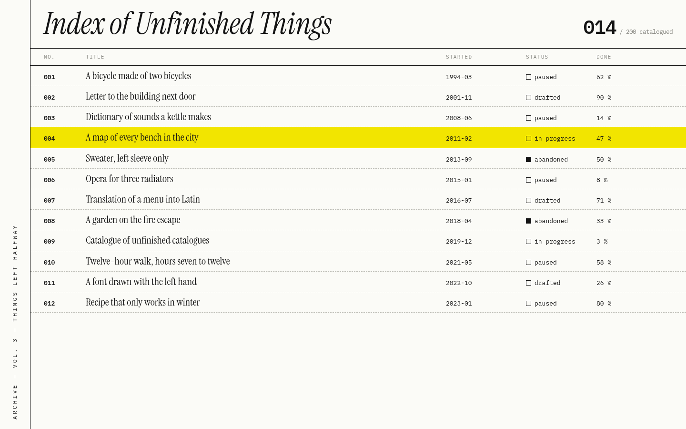
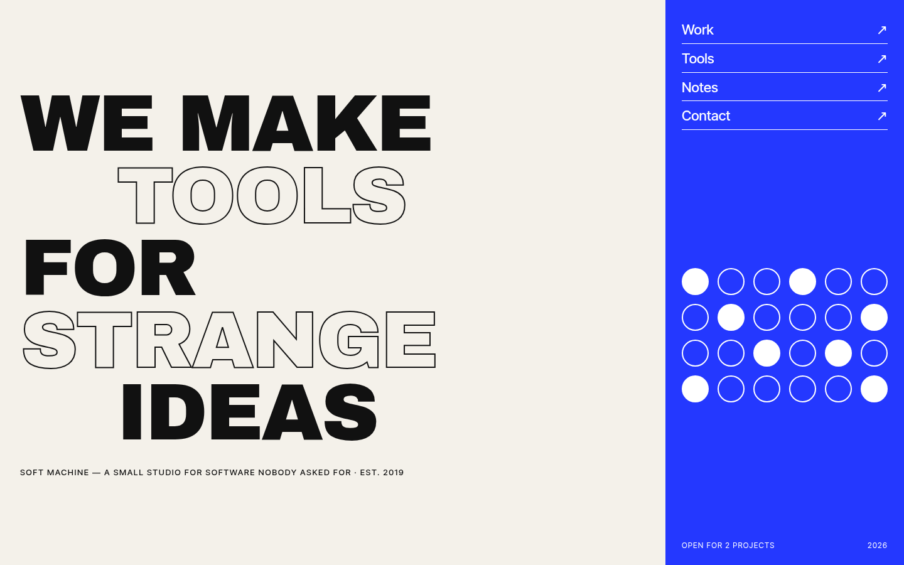

# examples/

Everything here was made in this repository, so it can be published (Apache-2.0, like the
rest).

## Gallery

Live pages with invented content, published on the
[gallery site](https://135andres.github.io/brutalist-design-skill/) (the repository's root
[`index.html`](../index.html)).

| Page | Made with | Principles taken from |
|---|---|---|
| [`gallery/low-hours/`](gallery/low-hours/index.html) | `inspire` (digestible questions) + `edit` (type test) — the maintainer's favourite, rebuilt with new content | its own sketches |
| [`gallery/adrift/`](gallery/adrift/index.html) | `inspire` | third-party reference #39 |
| [`gallery/slow-media/`](gallery/slow-media/index.html) | `inspire` | #40 |
| [`gallery/lichen-office/`](gallery/lichen-office/index.html) | `inspire` | #41 |
| [`gallery/kiln-type/`](gallery/kiln-type/index.html) | `inspire` | #42 |
| [`gallery/estatica/`](gallery/estatica/index.html) | `inspire` (digestible questions, second run; see [FINDINGS](../docs/FINDINGS.md)) | the maintainer's answers only — **not liked** (generic; not intuitive for new visitors), kept as a disposable experiment |

References #39–#42 are described in [`../references/`](../references/README.md), not
included. Each page's HTML header says what was taken from its reference.

## Experiments

Disposable sketches; the maintainer judges. [`experiments/provocations/`](experiments/provocations/README.md):
creative mode from zero, three premises, one invented brief. Not in the gallery.

## Original references

Three brutalist pages with invented content, rendered at 1440 × 900, DPR 1. Use the PNGs as
test inputs for [`recreate`](../skill/brutalist/references/recreate.md) and
[`inspire`](../skill/brutalist/references/inspire.md).

| Reference | Devices it exercises |
|---|---|
|  **A · Concrete Radio** | a marquee cut at the edge (motion inferred from a still); overlapping giant headline; heavy rules; a rotated badge |
|  **B · Index of Unfinished Things** | vertical text on a spine; a dense monospace list with dashed dividers; one highlighted row; italic serif display |
|  **C · Soft Machine** | outlined giant type (contrast of a stroke); a saturated blue panel; a grid of filled and empty dots |

B and C carry devices listed in
[`accessibility.md`](../skill/brutalist/references/accessibility.md) (vertical text,
outlined type), so they also test the accessibility rules.

The HTML each PNG was rendered from is in [`references/src/`](references/src/), to
regenerate the images. **When you use a reference to test `recreate`, do not open its
source** — the point is to work from the image alone.

## Worked example

[`recreate-concrete-radio/`](recreate-concrete-radio/README.md) — reference A, recreated
from its PNG: inventory, build, motion plan, report and every command. Read its limitation:
the same agent made the reference and the recreation.
